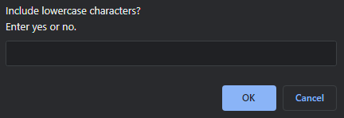

# Password Generator

## Description
User Story: As an employee with access to sensitive data, I want to randomly generate a password that meets certain criteria, so that I can create a strong password that provides greater security.

Acceptance Criteria: When I need a new and secure password, I click the button to generate a password and I am presented with a series of prompts for password criteria. When prompted for password criteria, I select which criteria to include in the password. When prompted for the length of the password, I choose a length of at least 8 characters and no more than 128 characters. When asked for character types to include in the password, I confirm whether or not to include lowercase, uppercase, numeric, and/or special characters. When I answer each prompt, my input should be validated and at least one character type should be selected. When all prompts are answered, a password is generated that matches the selected criteria. When the password is generated, the password is either displayed in an alert or written to the page.

---

Provide a short description explaining the what, why, and how of your project. Use the following questions as a guide:

- What was your motivation?
- Why did you build this project? (Note: the answer is not "Because it was a homework assignment.")
- What problem does it solve?
- What did you learn?

---
## Installation

There is nothing to install with this project. To see the final product, please visit this webpage: [https://pbp66.github.io/password-generator/](https://github.com/pbp66/password-generator)

## Usage

Upon visiting the website, you will come across the password generator in the center of the site. Clicking the red button labeled "Generate Password" will start the script and begin prompting you for password criteria.

After clicking the button, the length prompt appears at the top of your browser:

It will ask you to enter a number from 8 to 128 inclusive. This number will be the length of your password. If you enter a number outside of the range or a non-numeric character, you will receive the following alert:

Click ok and the program will redirect you back to the length input to try again.
Upon successful input, you will be prompted to include or exclude lowercase characters (a-z) by entering a yes or a no.

Upon successful input, you will be prompted to include or exclude uppercase characters (A-Z) by entering a yes or a no.

Upon successful input, you will be prompted to include or exclude numeric characters (0-9) by entering a yes or a no.

Upon successful input, you will be prompted to include or exclude special characters ( !"#$%&'()*+,-./:;<=>?@[\\]^_`{|}~) by entering a yes or a no.

If you input a response that is neither a yes nor a no, e.g. 4, hi, asldkfhj, etc, you will receive the alert below. Clicking ok will redirect you back to the previous question for proper input.

If you enter no for all criteria, you will receive the alert below. Clicking ok will redirect you to the beginning of the prompts to start over. 

To exit the password generation early, select cancel at any of the prompts. This will end the prompts. To proceed back through the password generation script, click the generate password button again.

## Credits

List your collaborators, if any, with links to their GitHub profiles.

If you used any third-party assets that require attribution, list the creators with links to their primary web presence in this section.

If you followed tutorials, include links to those here as well.

## License

The last section of a high-quality README file is the license. This lets other developers know what they can and cannot do with your project. If you need help choosing a license, refer to [https://choosealicense.com/](https://choosealicense.com/).

---

## How to Contribute

If you created an application or package and would like other developers to contribute it, you can include guidelines for how to do so. The [Contributor Covenant](https://www.contributor-covenant.org/) is an industry standard, but you can always write your own if you'd prefer.

## Tests

Go the extra mile and write tests for your application. Then provide examples on how to run them here.